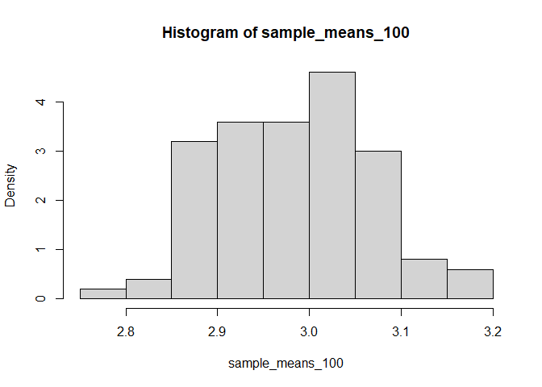
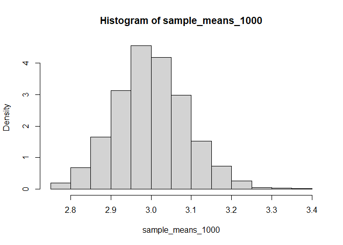
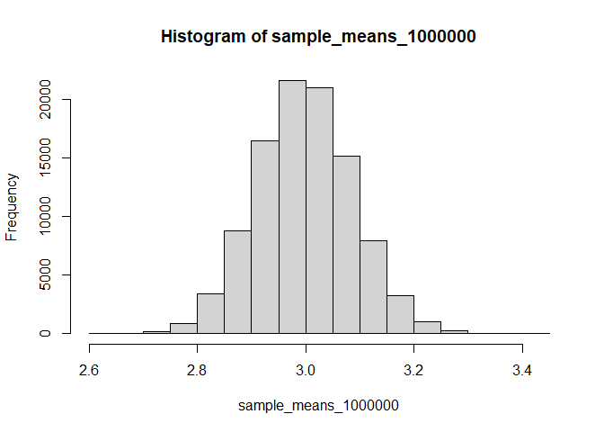

``` r
library(reshape2)
library(tidyverse)
library(boot)
library(knitr)
```

``` r
data <- tips
summary(data)
```

    ##    total_bill         tip             sex      smoker      day         time    
    ##  Min.   : 3.07   Min.   : 1.000   Female: 87   No :151   Fri :19   Dinner:176  
    ##  1st Qu.:13.35   1st Qu.: 2.000   Male  :157   Yes: 93   Sat :87   Lunch : 68  
    ##  Median :17.80   Median : 2.900                          Sun :76               
    ##  Mean   :19.79   Mean   : 2.998                          Thur:62               
    ##  3rd Qu.:24.13   3rd Qu.: 3.562                                                
    ##  Max.   :50.81   Max.   :10.000                                                
    ##       size     
    ##  Min.   :1.00  
    ##  1st Qu.:2.00  
    ##  Median :2.00  
    ##  Mean   :2.57  
    ##  3rd Qu.:3.00  
    ##  Max.   :6.00

## Including Plots

You can also embed plots, for example:

<!-- -->

``` r
results <- data.frame()
  
results[1,1] <- "1"
results[1,2] <-  mean(slice_sample(data, n=100, replace=TRUE)$tip)

results[2,1] <- "2"
results[2,2] <-  mean(slice_sample(data, n=100, replace=TRUE)$tip)

results[3,1] <- "3"
results[3,2] <-  mean(slice_sample(data, n=100, replace=TRUE)$tip)

colnames(results) <- c("Sample #", "Sample Mean")

results
```

    ##   Sample # Sample Mean
    ## 1        1      3.1151
    ## 2        2      2.9017
    ## 3        3      2.8694

``` r
set.seed(3)
```

``` r
sample_means_100 = vector()
for (i in 1:100) {
  sample_means_100[i] <- mean(slice_sample(data, prop=1, replace=TRUE)$tip)
}
```

``` r
hist(sample_means_100, freq=FALSE)
```

<!-- -->

``` r
sample_means_1000 = vector()
for (i in 1:1000) {
  sample_means_1000[i] <- mean(slice_sample(data, prop=1, replace=TRUE)$tip)
}
```

``` r
hist(sample_means_1000, freq=FALSE)
```

<!-- -->

``` r
bootstrap_func <- function(data_, i){
 return(mean(data_[i, ]$tip))
}
```

``` r
paste("For Loop")
```

    ## [1] "For Loop"

``` r
sample_means_1000 = vector()
system.time(
  for (i in 1:1000) {
  sample_means_1000[i] <- mean(slice_sample(data, prop=1, replace=TRUE)$tip)
}
)
```

    ##    user  system elapsed 
    ##    2.13    0.00    2.16

``` r
paste("Function (from `boot`)")
```

    ## [1] "Function (from `boot`)"

``` r
system.time(
  sample_means_boot <- boot(data,bootstrap_func,R=1000)
  )
```

    ##    user  system elapsed 
    ##    0.30    0.01    0.31

``` r
sample_means_boot <- boot(data,bootstrap_func,R=100000)
```

``` r
sample_means_1000000 <- sample_means_boot$t
hist(sample_means_1000000)
```

<!-- -->

``` r
(max(sample_means_1000000) - mean(sample_means_1000000)) / sd(sample_means_1000000)
```

    ## [1] 4.615244

``` r
(min(sample_means_1000000) - mean(sample_means_1000000)) / sd(sample_means_1000000)
```

    ## [1] -4.123977
