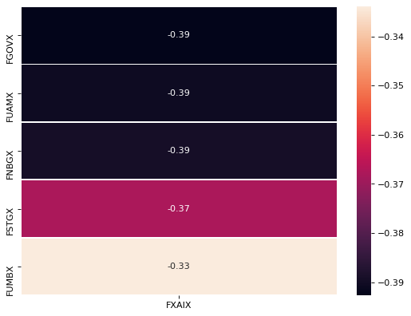

```python
import pandas as pd
import numpy as np
import regex as re
import yfinance as yf
import pickle
import os
import datetime
import seaborn as sns
from matplotlib.pyplot import figure
```
This notebook is an attempt to look at how different low cost Fidelity funds covary. Please note that this notebook is solely for education purposes and is not financial advice.
#### Data:
- `fidelity_funds.xlsx` 92 Fidelity funds that meet the following criteria:
    - No Transaction Fees, No minimum investment
    - below 0.75% net expense ratio
- `yfinance` API call that gathers historic returns for each fund

#### Question:
A typical investing strategy is to seek assets that are in some way [countercyclical](https://www.investopedia.com/terms/c/countercyclicalstock.asp#:~:text=Counter%2Dcyclical%20stocks%20refer%20to,cyclical%20stocks%20will%20do%20well.) so as to mitigate portfolio risk during economic downturns. A retail investor seeking to create a portfolio with some inverse correlation between assets might seek to purchase some combination of low cost stock and bond funds to this end. Given this, I'm curious which Fidelity funds (Fidelity being one of the more popular retail brokerages) are the most countercyclical to stocks, or, which are most inversely correlated with the returns of a major stock index - in this case the S&P500. More broadly, I seek to answer whether it's even possible to have a portfolio purely of low-cost Fidelity funds that has meaningful inverse correlation between investments if the S&P500 is a central part of the portfolio.

#### Methods:
I take the daily historical returns (in percent change) of a group of Fidelity funds (criteria defined above) and calculate the correlation coefficient, $\rho_i$ between each fund and a baseline fund, `"FXAIX"`, which is the Fidelity fund that seeks to mimic the S&P500.

For statistical testing, I compute 95% confidence intervals of each $\rho_{i}$ via bootstrapping and sort those values by their $97.5\\%$ value

### Data Processing - `fidelity_funds.xlsx`


```python
funds_df_raw = pd.read_excel("fidelity_funds.xlsx")
```


```python
funds_df_raw.head()
```


<div>
<style scoped>
    .dataframe tbody tr th:only-of-type {
        vertical-align: middle;
    }

    .dataframe tbody tr th {
        vertical-align: top;
    }

    .dataframe thead th {
        text-align: right;
    }
</style>
<table border="1" class="dataframe">
  <thead>
    <tr style="text-align: right;">
      <th></th>
      <th>Name</th>
      <th>Morningstar Category</th>
      <th>YTD (Daily)</th>
      <th>1 Yr</th>
      <th>3 Yr</th>
      <th>5 Yr</th>
      <th>10 Yr</th>
      <th>Life of Fund</th>
      <th>Expense Ratio - Net</th>
      <th>Expense Ratio - Gross</th>
      <th>Morningstar- Overall</th>
      <th>Morningstar- 3yrs</th>
      <th>Morningstar- 5yrs</th>
      <th>Morningstar- 10yrs</th>
    </tr>
  </thead>
  <tbody>
    <tr>
      <th>0</th>
      <td>Fidelity ZERO&lt;sup&gt;SM&lt;/sup&gt; Extended Market Ind...</td>
      <td>Mid-Cap Blend</td>
      <td>-0.1035</td>
      <td>2.67% (02/28/2022)</td>
      <td>12.84% (02/28/2022)</td>
      <td>-</td>
      <td>-</td>
      <td>9.45% (02/28/2022)</td>
      <td>0.00000</td>
      <td>0.00000</td>
      <td>2 (360 Rated)</td>
      <td>2 (360 Rated)</td>
      <td>-</td>
      <td>-</td>
    </tr>
    <tr>
      <th>1</th>
      <td>Fidelity ZERO&lt;sup&gt;SM&lt;/sup&gt; Large Cap Index Fun...</td>
      <td>Large Blend</td>
      <td>-0.1227</td>
      <td>14.41% (02/28/2022)</td>
      <td>18.37% (02/28/2022)</td>
      <td>-</td>
      <td>-</td>
      <td>14.65% (02/28/2022)</td>
      <td>0.00000</td>
      <td>0.00000</td>
      <td>4 (1232 Rated)</td>
      <td>4 (1232 Rated)</td>
      <td>-</td>
      <td>-</td>
    </tr>
    <tr>
      <th>2</th>
      <td>Fidelity ZERO&lt;sup&gt;SM&lt;/sup&gt; Total Market Index ...</td>
      <td>Large Blend</td>
      <td>-0.1204</td>
      <td>12.64% (02/28/2022)</td>
      <td>17.59% (02/28/2022)</td>
      <td>-</td>
      <td>-</td>
      <td>14.36% (02/28/2022)</td>
      <td>0.00000</td>
      <td>0.00000</td>
      <td>3 (1232 Rated)</td>
      <td>3 (1232 Rated)</td>
      <td>-</td>
      <td>-</td>
    </tr>
    <tr>
      <th>3</th>
      <td>Fidelity 500 Index Fund (FXAIX)</td>
      <td>Large Blend</td>
      <td>-0.1153</td>
      <td>16.37% (02/28/2022)</td>
      <td>18.23% (02/28/2022)</td>
      <td>15.16% (02/28/2022)</td>
      <td>14.58% (02/28/2022)</td>
      <td>10.89% (02/28/2022)</td>
      <td>0.00015</td>
      <td>0.00015</td>
      <td>5 (1232 Rated)</td>
      <td>4 (1232 Rated)</td>
      <td>4 (1108 Rated)</td>
      <td>5 (819 Rated)</td>
    </tr>
    <tr>
      <th>4</th>
      <td>Fidelity Total Market Index Fund (FSKAX)</td>
      <td>Large Blend</td>
      <td>-0.1220</td>
      <td>11.94% (02/28/2022)</td>
      <td>17.43% (02/28/2022)</td>
      <td>14.60% (02/28/2022)</td>
      <td>14.20% (02/28/2022)</td>
      <td>8.63% (02/28/2022)</td>
      <td>0.00015</td>
      <td>0.00015</td>
      <td>4 (1232 Rated)</td>
      <td>3 (1232 Rated)</td>
      <td>3 (1108 Rated)</td>
      <td>4 (819 Rated)</td>
    </tr>
  </tbody>
</table>
</div>


The `Name` feature above contains the ticker symbol for each fund, but wrapped in other text. The following extracts that ticker.


```python
# Extract ticker symbols from the "Name" field
funds_df_raw["Ticker"] = (funds_df_raw["Name"]
                          .str.extract(r"\(([A-Z]*)\)")
                          .astype(str))
```


```python
# Drop any row without performance data from this year
funds_df = funds_df_raw.dropna(subset=["YTD (Daily)"])
```

### Data Retrieval from `yfinance`
This script returns comprehensive historical data via *Yahoo Finance* for each fund, then saves that data as a `Pickle` object. If the data has already been retrieved, the script will display the date/time of the last retrieval.


```python
if os.path.exists('fidelity_funds.pickle'):
    print("Fidelity fund info already retrieved @", 
          datetime.datetime.fromtimestamp(
              os.path.getctime('fidelity_funds.pickle')
          )
         )
else:
    stocks = {}
    for ticker in funds_df["Ticker"]:
        stock = yf.Ticker(ticker)
        # get all market data
        hist = stock.history(period="max")
        stocks[ticker] = hist
        with open('fidelity_funds.pickle', 'wb') as f:
            pickle.dump(stocks, f)
```

    Fidelity fund info already retrieved @ 2022-03-14 16:59:09.785354
    

### Processing `yfinance` data 
The following code will convert daily `Close` figures to percent change form and assign that new data to `Pct_Change`, then add each fund name as a prefix. The result will be a series of columns with percent change figures for each fund, titled, for example, `FXAIX_Pct_Change`.


```python
with open('fidelity_funds.pickle', 'rb') as f:
    stocks = pickle.load(f)
```


```python
for stock_name, stock_data in stocks.items():
    stock_data['Pct_Change'] = stock_data['Close'].pct_change()
```


```python
t = pd.concat(
    [df[["Pct_Change"]].rename(columns={"Pct_Change": name})
     for name, df in stocks.items()], 
    axis=1)
```

### Population Results
The following are the 5 Fidelity funds that are most uncorrelated with FXAIX, as measured by $\rho_i$ computed from all available data.


```python
figure(figsize=(8, 6), dpi=80)
t_no_na = t.dropna(thresh=30)
(sns.heatmap(t_no_na.corr()["FXAIX"]
             .sort_values()
             .to_frame()
             .head(),
             annot=True, linewidths=.5));
```


    



### Bootstrap Code
In order to get a better idea of the variance of each of these $\rho_i$, I proceed to compute $95\\%$ confidence intervals for each using the [bootstrap](https://en.wikipedia.org/wiki/Bootstrapping_(statistics) ). I sort these values by their $97.5th$ percentiles. With the bootstrap data, I can conduct a simple hypothesis test that asks whether any $\rho_i$ is truly uncorrelated with `FXAIX` at $95\\%$ confidence.
  
$H_0: \min(\rho) > 0$  
$H_A: \min(\rho) \leq 0$


```python
baseline = "FXAIX"
boot_iter = 10000
sample_size = 100
confidence = 0.95
alpha = round((1-confidence)/2, 3)

bootstrap_results = pd.concat(
    [(
        t_no_na.sample(sample_size, replace=True)
        .corr()[baseline]
        .to_frame()
        .sort_values(by=baseline)
        .rename(columns={baseline: rep})
    )
     for rep in range(boot_iter)], axis=1).T
```


```python
bottom_covariates = (bootstrap_results
                     .quantile(q=[alpha, .5, 1-alpha])
                     .T
                     .sort_values(by=1-alpha,
                                  ascending=True)
                     .head(20)
                    )
```

### Bootstrap Results
It would seem from the resuls of this test that at the $95\\%$ confidence we cannot reject $H_0$ and must conclude that none of these funds have statistically significant inverse correlation with `FXAIX`, though `FSTGX` is closest. These results would suggest that the retail investor making use of exclusively low cost Fidelity funds and seeking to have a diverse portfolio centered around `FXAIX` would be limited by the fact that no funds achieve statistically significant inverse correlation.


```python
(
    pd.merge(bottom_covariates,
             funds_df[["Morningstar Category",
                       "Ticker",
                       "Life of Fund",
                       "Expense Ratio - Net"]],
             left_index=True, right_on="Ticker"
            )
    .reset_index().drop("index", axis=1)
    .head(10)
)
```


<div>
<style scoped>
    .dataframe tbody tr th:only-of-type {
        vertical-align: middle;
    }

    .dataframe tbody tr th {
        vertical-align: top;
    }

    .dataframe thead th {
        text-align: right;
    }
</style>
<table border="1" class="dataframe">
  <thead>
    <tr style="text-align: right;">
      <th></th>
      <th>0.025</th>
      <th>0.5</th>
      <th>0.975</th>
      <th>Morningstar Category</th>
      <th>Ticker</th>
      <th>Life of Fund</th>
      <th>Expense Ratio - Net</th>
    </tr>
  </thead>
  <tbody>
    <tr>
      <th>0</th>
      <td>-0.698790</td>
      <td>-0.355725</td>
      <td>0.008711</td>
      <td>Intermediate Government</td>
      <td>FSTGX</td>
      <td>4.67% (02/28/2022)</td>
      <td>0.00450</td>
    </tr>
    <tr>
      <th>1</th>
      <td>-0.730368</td>
      <td>-0.387143</td>
      <td>0.058093</td>
      <td>Intermediate Government</td>
      <td>FGOVX</td>
      <td>6.52% (02/28/2022)</td>
      <td>0.00450</td>
    </tr>
    <tr>
      <th>2</th>
      <td>-0.603529</td>
      <td>-0.280054</td>
      <td>0.074050</td>
      <td>Short Government</td>
      <td>FFXSX</td>
      <td>4.36% (02/28/2022)</td>
      <td>0.00450</td>
    </tr>
    <tr>
      <th>3</th>
      <td>-0.640167</td>
      <td>-0.305014</td>
      <td>0.225213</td>
      <td>Intermediate Core Bond</td>
      <td>FXNAX</td>
      <td>5.57% (02/28/2022)</td>
      <td>0.00025</td>
    </tr>
    <tr>
      <th>4</th>
      <td>-0.487287</td>
      <td>-0.154161</td>
      <td>0.243838</td>
      <td>Intermediate Government</td>
      <td>FGMNX</td>
      <td>5.64% (02/28/2022)</td>
      <td>0.00450</td>
    </tr>
    <tr>
      <th>5</th>
      <td>-0.782007</td>
      <td>-0.311291</td>
      <td>0.278759</td>
      <td>Short Government</td>
      <td>FUMBX</td>
      <td>2.36% (02/28/2022)</td>
      <td>0.00030</td>
    </tr>
    <tr>
      <th>6</th>
      <td>-0.828349</td>
      <td>-0.361122</td>
      <td>0.279795</td>
      <td>Intermediate Government</td>
      <td>FUAMX</td>
      <td>4.08% (02/28/2022)</td>
      <td>0.00030</td>
    </tr>
    <tr>
      <th>7</th>
      <td>-0.588389</td>
      <td>-0.152732</td>
      <td>0.293197</td>
      <td>Inflation-Protected Bond</td>
      <td>FIPDX</td>
      <td>2.63% (02/28/2022)</td>
      <td>0.00050</td>
    </tr>
    <tr>
      <th>8</th>
      <td>-0.588615</td>
      <td>-0.262600</td>
      <td>0.304981</td>
      <td>Intermediate Core Bond</td>
      <td>FTHRX</td>
      <td>6.74% (02/28/2022)</td>
      <td>0.00450</td>
    </tr>
    <tr>
      <th>9</th>
      <td>-0.839990</td>
      <td>-0.372222</td>
      <td>0.331665</td>
      <td>Long Government</td>
      <td>FNBGX</td>
      <td>5.86% (02/28/2022)</td>
      <td>0.00030</td>
    </tr>
  </tbody>
</table>
</div>


