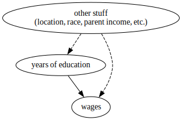
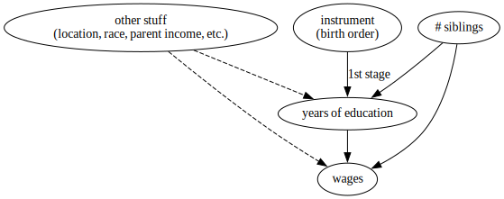


```python
# Wooldridge (2019) datasets
import wooldridge as woo
# Base scientific computing
import numpy as np
import pandas as pd
import matplotlib.pyplot as plt
# Stats packages
import linearmodels.iv as iv
from linearmodels.iv import IV2SLS
import statsmodels.formula.api as smf
import scipy as sp
# Drawing DAGS
import graphviz as gr
```


The following are my notes on the use of instrumental variables for finding causal effects. These are largely notes on the following:
- Chapter 15 in (Wooldridge 2019), including the computer exercises [[1]](#1)
- Chapter 8 in (Alves 2022) [[2]](#2)
- Chapter 7 in (Cunningham 2021) [[3]](#3)

I'm writing this mostly for my own future reference, but hope it might be helpful to others.   

## Why IV?

### IV versus RCTs
What do we do if we cannot run an experiment and block all "back-door" paths by conditioning on observed variables?
- One answer: get better/more complete data
- But that's often not possible.
In particular, if we are worried about selection -- namely that people select different "treatment" based on anticipated effects -- that isn't measurable, we cannot simply get better data.

A "natural experiment" leverages variation in the treatment that is random with respect to potential outcomes (e.g. there is no selection on un-observables) and occurs without research intervention.

### IV versus other quasi-experiments
Like most quasi-experimental methods, IV gives us access to a "long regression model" -- one without omitted variables -- without having to actually observe those omitted variables (we only have access to the "short regression model").  

(Wooldridge 2019) introduces IV after fixed effects and panel data models -- in my view more intuitive causal models. The following is a useful comparison of IV to panel data methods from (Wooldridge 2019):
> In the previous two chapters, we explained how fixed effects estimation or first differencing can
be used with panel data to **estimate the effects of time-varying independent variables in the presence
of time-constant omitted variables**. Although such methods are very useful, **we do not always have
access to panel data**. Even if we can obtain panel data, it does us little good if we are interested in **the
effect of a variable that does not change over time**: first differencing or fixed effects estimation eliminates time-constant explanatory variables.

Thus, unlike fixed effects (FE) models, IV can be used with cross sectional data. Also unlike FE, IV allows us to examine the effects of time-fixed variables.

The big takeaway as I see it is that, like FE, IV can remove omitted variable bias, specifically selection bias in impact evaluation. FE can also remove omitted variable bias, but only for variables that are fixed in time, and FE can only evaluate the impact of variables that vary over time. IV can remove bias from variables that vary with time (in a panel data setting) and can evaluate the impact of time-fixed variables. Let's see how this looks with actual data....


# What's the causal effect of schooling on wages?
I'll load some data included in (Wooldridge 2019)  -- originally from the [Young Men's Cohort of the
National Longitudinal Survey (NLS)](https://www.bls.gov/nls/original-cohorts/older-and-young-men.htm) but pre-processed for students.


```python
woo.dataWoo("wage2", description=True)
```

    name of dataset: wage2
    no of variables: 17
    no of observations: 935
    
    +----------+-------------------------------+
    | variable | label                         |
    +----------+-------------------------------+
    | wage     | monthly earnings              |
    | hours    | average weekly hours          |
    | IQ       | IQ score                      |
    | KWW      | knowledge of world work score |
    | educ     | years of education            |
    | exper    | years of work experience      |
    | tenure   | years with current employer   |
    | age      | age in years                  |
    | married  | =1 if married                 |
    | black    | =1 if black                   |
    | south    | =1 if live in south           |
    | urban    | =1 if live in SMSA            |
    | sibs     | number of siblings            |
    | brthord  | birth order                   |
    | meduc    | mother's education            |
    | feduc    | father's education            |
    | lwage    | natural log of wage           |
    +----------+-------------------------------+
    
    M. Blackburn and D. Neumark (1992), “Unobserved Ability, Efficiency
    Wages, and Interindustry Wage Differentials,” Quarterly Journal of
    Economics 107, 1421-1436. Professor Neumark kindly provided the data,
    of which I used just the data for 1980.
    


```python
wage = woo.dataWoo("wage2", description=False)
wage.head()
```


<div>
<style scoped>
    .dataframe tbody tr th:only-of-type {
        vertical-align: middle;
    }

    .dataframe tbody tr th {
        vertical-align: top;
    }

    .dataframe thead th {
        text-align: right;
    }
</style>
<table border="1" class="dataframe">
  <thead>
    <tr style="text-align: right;">
      <th></th>
      <th>wage</th>
      <th>hours</th>
      <th>IQ</th>
      <th>KWW</th>
      <th>educ</th>
      <th>exper</th>
      <th>tenure</th>
      <th>age</th>
      <th>married</th>
      <th>black</th>
      <th>south</th>
      <th>urban</th>
      <th>sibs</th>
      <th>brthord</th>
      <th>meduc</th>
      <th>feduc</th>
      <th>lwage</th>
    </tr>
  </thead>
  <tbody>
    <tr>
      <th>0</th>
      <td>769</td>
      <td>40</td>
      <td>93</td>
      <td>35</td>
      <td>12</td>
      <td>11</td>
      <td>2</td>
      <td>31</td>
      <td>1</td>
      <td>0</td>
      <td>0</td>
      <td>1</td>
      <td>1</td>
      <td>2.0</td>
      <td>8.0</td>
      <td>8.0</td>
      <td>6.645091</td>
    </tr>
    <tr>
      <th>1</th>
      <td>808</td>
      <td>50</td>
      <td>119</td>
      <td>41</td>
      <td>18</td>
      <td>11</td>
      <td>16</td>
      <td>37</td>
      <td>1</td>
      <td>0</td>
      <td>0</td>
      <td>1</td>
      <td>1</td>
      <td>NaN</td>
      <td>14.0</td>
      <td>14.0</td>
      <td>6.694562</td>
    </tr>
    <tr>
      <th>2</th>
      <td>825</td>
      <td>40</td>
      <td>108</td>
      <td>46</td>
      <td>14</td>
      <td>11</td>
      <td>9</td>
      <td>33</td>
      <td>1</td>
      <td>0</td>
      <td>0</td>
      <td>1</td>
      <td>1</td>
      <td>2.0</td>
      <td>14.0</td>
      <td>14.0</td>
      <td>6.715384</td>
    </tr>
    <tr>
      <th>3</th>
      <td>650</td>
      <td>40</td>
      <td>96</td>
      <td>32</td>
      <td>12</td>
      <td>13</td>
      <td>7</td>
      <td>32</td>
      <td>1</td>
      <td>0</td>
      <td>0</td>
      <td>1</td>
      <td>4</td>
      <td>3.0</td>
      <td>12.0</td>
      <td>12.0</td>
      <td>6.476973</td>
    </tr>
    <tr>
      <th>4</th>
      <td>562</td>
      <td>40</td>
      <td>74</td>
      <td>27</td>
      <td>11</td>
      <td>14</td>
      <td>5</td>
      <td>34</td>
      <td>1</td>
      <td>0</td>
      <td>0</td>
      <td>1</td>
      <td>10</td>
      <td>6.0</td>
      <td>6.0</td>
      <td>11.0</td>
      <td>6.331502</td>
    </tr>
  </tbody>
</table>
</div>


## Using OLS

I estimate the regression, $log(wage) = \beta_0 + \beta_1 educ + u$, which should tell me the effect of education on wages. The results are as follows:


```python
(smf.ols("lwage ~ educ",
         data=wage)
 .fit()
 .summary()
 .tables[1]
)
```


<table class="simpletable">
<tr>
      <td></td>         <th>coef</th>     <th>std err</th>      <th>t</th>      <th>P>|t|</th>  <th>[0.025</th>    <th>0.975]</th>  
</tr>
<tr>
  <th>Intercept</th> <td>    5.9731</td> <td>    0.081</td> <td>   73.403</td> <td> 0.000</td> <td>    5.813</td> <td>    6.133</td>
</tr>
<tr>
  <th>educ</th>      <td>    0.0598</td> <td>    0.006</td> <td>   10.035</td> <td> 0.000</td> <td>    0.048</td> <td>    0.072</td>
</tr>
</table>


Note that the `educ` coefficient can be interepreted as the following percentage increase in wages for each year of education:


```python
(np.exp(0.0598) - 1) * 100
```


    6.162420047136585


I have an estimate in hand, but it's fairly clear that this isn't really the causal effect of education on wages. I'm not adjusting the equation for any other variables, so the influence of unobserved characteristics, e.g. location, race, parental income, etc., are all contained in the error term, $u$. **Years of education is probably related to a number of those unobserved characteristics, thus $\text{Cov}(educ, u) \neq 0$ and OLS will yield biased estimates.**  

The Directed Acyclic Graph (DAG) below illustrates the situation:


```python
g = gr.Digraph()
educ_ = 'years of education'
other_ = 'other stuff\n(location, race, parent income, etc.)'
wages_ = 'wages'
g.edge(other_, educ_, style = 'dashed')
g.edge(other_, wages_, style = 'dashed' )
g.edge(educ_, wages_)
g
```


    

    


Note that the dashed lines represent unobserved relationships (Cunningham 2021)

## Using IV
To fix this, I can try using instrumental variables as outlined in (Wooldridge 2019):
> **In order to obtain consistent estimators of $\beta_0$ and $\beta_1$ when x and u are correlated, we need some
additional information.**  
The information comes by way of a new variable that satisfies certain properties. Suppose that we have an observable variable z that satisfies these two assumptions:  
>
>1. z is uncorrelated with u, that is, $\text{Cov}(z, u) = 0$  
>2. z is correlated with x, that is, $\text{Cov}(z, x) \neq 0$  
>
>Then, **we call z an instrumental variable for x, or sometimes simply an instrument for x**

(1) above satisifies "instrument exogeneity," meaning that the instrument, z, is exogenous. (2) satisfies "instrument relevance," meaning that z is relevant for explaining variation in x -- this is sometimes referred to as the **first stage**. (2) is explicitly testable, whereas (1) is unfortunately not testable. Justifying (1) typically relys on theoretical rather than empirical arguments, **unless $z$ is something that was randomly assigned, in which case (1) is proven.**


### IV 1 - Number of Siblings
In my case, I might hypothesize that the number of siblings that a person in this dataset has is not related to unobervables like location, race, parental income, etc. (this is probably tenuous). If I accepted that as true, I can directly test (2) via regression or correlation test


```python
smf.ols("educ ~ sibs", data=wage).fit().summary().tables[1]
```


<table class="simpletable">
<tr>
      <td></td>         <th>coef</th>     <th>std err</th>      <th>t</th>      <th>P>|t|</th>  <th>[0.025</th>    <th>0.975]</th>  
</tr>
<tr>
  <th>Intercept</th> <td>   14.1388</td> <td>    0.113</td> <td>  124.969</td> <td> 0.000</td> <td>   13.917</td> <td>   14.361</td>
</tr>
<tr>
  <th>sibs</th>      <td>   -0.2279</td> <td>    0.030</td> <td>   -7.528</td> <td> 0.000</td> <td>   -0.287</td> <td>   -0.168</td>
</tr>
</table>


```python
sp.stats.pearsonr(wage['educ'], wage['sibs'])
```


    PearsonRResult(statistic=-0.23928810445331095, pvalue=1.215402261762968e-13)


Sibling count is moderately correlated with education and statistically significant. This weak correlation means this is a fairly **weak instrument**, which isn't good. One of my favorite visuals of the effect of weak instruments on IV estimates can be found in [Causal Inference for The Brave and True, by Matheus Facure Alves](https://matheusfacure.github.io/python-causality-handbook/08-Instrumental-Variables.html#weakness-of-instruments) (see "Variance of the IV Estimates by 1st Stage Strength"):  


Thus, the low correlation between my instrument and my outcome will increase the variance of my average treatment effect estimates. That said, I'll continue with using siblings as my instrument for now, and estimate the IV model using the following DAG:


```python
g = gr.Digraph()
sib_ = 'instrument\n(# siblings)'
g.edge(other_, educ_, style='dashed')
g.edge(sib_, educ_, label="1st stage")
g.edge(other_, wages_, style='dashed' )
g.edge(educ_, wages_)
g
```


    

    


```python
reg_iv = iv.IV2SLS.from_formula(formula="lwage ~ 1 + [educ ~ sibs]",
                                data=wage)
results_iv = reg_iv.fit(cov_type="unadjusted",
                        debiased=True)
results_iv.summary
```


<table class="simpletable">
<caption>IV-2SLS Estimation Summary</caption>
<tr>
  <th>Dep. Variable:</th>          <td>lwage</td>      <th>  R-squared:         </th>  <td>-0.0092</td>
</tr>
<tr>
  <th>Estimator:</th>             <td>IV-2SLS</td>     <th>  Adj. R-squared:    </th>  <td>-0.0103</td>
</tr>
<tr>
  <th>No. Observations:</th>        <td>935</td>       <th>  F-statistic:       </th>  <td>21.588</td> 
</tr>
<tr>
  <th>Date:</th>             <td>Sat, Mar 25 2023</td> <th>  P-value (F-stat)   </th>  <td>0.0000</td> 
</tr>
<tr>
  <th>Time:</th>                 <td>11:28:29</td>     <th>  Distribution:      </th> <td>F(1,933)</td>
</tr>
<tr>
  <th>Cov. Estimator:</th>      <td>unadjusted</td>    <th>                     </th>     <td></td>    
</tr>
<tr>
  <th></th>                          <td></td>         <th>                     </th>     <td></td>    
</tr>
</table>
<table class="simpletable">
<caption>Parameter Estimates</caption>
<tr>
      <td></td>      <th>Parameter</th> <th>Std. Err.</th> <th>T-stat</th> <th>P-value</th> <th>Lower CI</th> <th>Upper CI</th>
</tr>
<tr>
  <th>Intercept</th>  <td>5.1300</td>    <td>0.3552</td>   <td>14.444</td> <td>0.0000</td>   <td>4.4330</td>   <td>5.8271</td> 
</tr>
<tr>
  <th>educ</th>       <td>0.1224</td>    <td>0.0264</td>   <td>4.6463</td> <td>0.0000</td>   <td>0.0707</td>   <td>0.1741</td> 
</tr>
</table>


**IV yields an estimate of 0.1224 -- more than double the OLS estimate!**. In percentage terms, that's a 13.02 ppt increase per year.


```python
(np.exp(0.1224) - 1) * 100
```


    13.020609381341085


I'll note from (Wooldridge 2019) regarding the negative R^2 value:  
> [When using IV], the **R-squared has no natural interpretation** [...] If our goal was to produce the largest R-squared, we would always use OLS. IV methods are intended to provide better estimates of the ceteris paribus effect of x on y when x and u are correlated; goodness-of-fit is not a factor

### IV 2 - Birth Order
I'll try this whole process again with a different instrument, this time birth order (where one is a first born child and so on).  
I believe that birth order and educational attainment might be negatively correlated -- namely that the later-birthed children in a family obtain fewer years of education. This could be due to budget contraints for the family. I regress `educ` on `brthord` and do find negative linear relationship:


```python
# Note - birth order has missing values
wage_clean = wage.dropna(subset='brthord')
```


```python
(smf.ols("educ ~ brthord", data=wage_clean)
 .fit()
 .summary()
 .tables[1]
)
```


<table class="simpletable">
<tr>
      <td></td>         <th>coef</th>     <th>std err</th>      <th>t</th>      <th>P>|t|</th>  <th>[0.025</th>    <th>0.975]</th>  
</tr>
<tr>
  <th>Intercept</th> <td>   14.1494</td> <td>    0.129</td> <td>  109.962</td> <td> 0.000</td> <td>   13.897</td> <td>   14.402</td>
</tr>
<tr>
  <th>brthord</th>   <td>   -0.2826</td> <td>    0.046</td> <td>   -6.106</td> <td> 0.000</td> <td>   -0.373</td> <td>   -0.192</td>
</tr>
</table>


A correlation test shows in different units that there is a mild negative correlation that is statistically significant.


```python
sp.stats.pearsonr(wage_clean['educ'], wage_clean['brthord'])
```


    PearsonRResult(statistic=-0.2049924622323121, pvalue=1.5507919847937432e-09)


Given that I've established at least weak correlation, I'll go ahead and try estimating IV:


```python
reg_iv = iv.IV2SLS.from_formula(
    formula="lwage ~ 1 + [educ ~ brthord]",
    data=wage_clean)
results_iv = reg_iv.fit(cov_type="unadjusted",
                        debiased=True)
results_iv.summary
```


<table class="simpletable">
<caption>IV-2SLS Estimation Summary</caption>
<tr>
  <th>Dep. Variable:</th>          <td>lwage</td>      <th>  R-squared:         </th>  <td>-0.0286</td>
</tr>
<tr>
  <th>Estimator:</th>             <td>IV-2SLS</td>     <th>  Adj. R-squared:    </th>  <td>-0.0298</td>
</tr>
<tr>
  <th>No. Observations:</th>        <td>852</td>       <th>  F-statistic:       </th>  <td>16.628</td> 
</tr>
<tr>
  <th>Date:</th>             <td>Sat, Mar 25 2023</td> <th>  P-value (F-stat)   </th>  <td>0.0000</td> 
</tr>
<tr>
  <th>Time:</th>                 <td>11:28:29</td>     <th>  Distribution:      </th> <td>F(1,850)</td>
</tr>
<tr>
  <th>Cov. Estimator:</th>      <td>unadjusted</td>    <th>                     </th>     <td></td>    
</tr>
<tr>
  <th></th>                          <td></td>         <th>                     </th>     <td></td>    
</tr>
</table>
<table class="simpletable">
<caption>Parameter Estimates</caption>
<tr>
      <td></td>      <th>Parameter</th> <th>Std. Err.</th> <th>T-stat</th> <th>P-value</th> <th>Lower CI</th> <th>Upper CI</th>
</tr>
<tr>
  <th>Intercept</th>  <td>5.0304</td>    <td>0.4329</td>   <td>11.619</td> <td>0.0000</td>   <td>4.1806</td>   <td>5.8802</td> 
</tr>
<tr>
  <th>educ</th>       <td>0.1306</td>    <td>0.0320</td>   <td>4.0777</td> <td>0.0000</td>   <td>0.0678</td>   <td>0.1935</td> 
</tr>
</table>


This yields 0.1306, a similar estimate as when I used sibling count as an instument (0.1224). Again, this is more than double the OLS estimate, but it would be nice if the first stage were stronger, and I don't feel so confident about the instrument exogeneity assumption (I think birth order might be correlated with income with the error term, and I think birth order might be correlated with wages via mechanisms other than education -- like getting more attention from your parents or something).   

# IV Calculation Notes
As notes, I'll write out some of the equations of IV to shed some more light on what it is. Note that all of these "by hand" calculations will return incorrect standard errors.
## IV as two stage least squares  
1. Estimate the following:
$$ \hat{educ} = \pi_0 + \pi_1 brthord $$
2. Then use the predicted values of $\hat{educ}$ as the explanatory variable
$$ log(wage) = \beta_0 + \beta_1 \hat{educ} $$


```python
# 1. in code
educ_hat = smf.ols("educ ~ brthord", data=wage_clean).fit().predict()
```


```python
# 2. in code
iv_subset = wage_clean[['lwage']].assign(educ_hat = educ_hat)
smf.ols("lwage ~ educ_hat", data=iv_subset).fit().summary().tables[1]
```


<table class="simpletable">
<tr>
      <td></td>         <th>coef</th>     <th>std err</th>      <th>t</th>      <th>P>|t|</th>  <th>[0.025</th>    <th>0.975]</th>  
</tr>
<tr>
  <th>Intercept</th> <td>    5.0304</td> <td>    0.423</td> <td>   11.904</td> <td> 0.000</td> <td>    4.201</td> <td>    5.860</td>
</tr>
<tr>
  <th>educ_hat</th>  <td>    0.1306</td> <td>    0.031</td> <td>    4.178</td> <td> 0.000</td> <td>    0.069</td> <td>    0.192</td>
</tr>
</table>


### IV as the ratio of reduced form and first stage estimates
$ATE_{IV} = \dfrac{\text{Reduced Form}} 
{\text{1st Stage}}$  

(or in longer terms: $\kappa = \dfrac{\text{Reduced Form}}{\text{1st Stage}} = \dfrac{Cov(Y_i, Z_i)/V(Z_i)}{Cov(T_i, Z_i)/V(Z_i)} = \dfrac{Cov(Y_i, Z_i)}{Cov(T_i, Z_i)}$)


```python
iv_est = (
    # The reduced form
    np.cov(wage_clean['brthord'], wage_clean['lwage'])[0][1]
    / 
    # the first stage
    np.cov(wage_clean['brthord'], wage_clean['educ'])[0][1]
)
iv_est
```


    0.13064482653341536


# Multiple regresssion IV
Let's say we're given the following multiple regression equation:  
$$y_1 = \beta_0 + \beta_1 y_2 + \beta_2 z_1 + u_1 $$  
We are interested in the effect of $y_2$ on $y_1$, thus we want to estimate $\beta_1$. Let's also say that I know that there is omitted variable bias on $y_2$ - thus $\text{Cov}(y_2, u_1) \neq 0 $. OLS  estimates will be biased. IV is appropriate here, but the instrument cannot also be used as a covariate in the equation (thus $z_1$ cannot be an intrument). **I'll need to find a different instrument which I'll call $z_2$**. Wooldridge explains some of the requirements for this instrument as follows:

> We still need the instrumental variable $z_2$ to be correlated with $y_2$, but the sense in which these two variables must be correlated is complicated by the presence of $z_1$ in the equation. We now need to state the assumption in terms of partial correlation. The easiest way to state the condition is to write the endogenous explanatory variable as a linear function of the exogenous variables and an error term:
$$y_2 = \pi_0 + \pi_1 z_1 + \pi_2 z_2 + v_2$$  


That equation is the "reduced form" equation, which describes the first stage of IV estimation (using the instrument to predict the explanatory variable $y_2$). As is typical in IV, the identifying assumption is that $\pi_2 \neq 0$, or in words, that $z_2$ is still correlated with $y_2$ after "partialing out"/holding constant $z_1$ (note that $\pi_1$ can be zero, it doesn't matter). (Wooldridge 2019) also mentions the following extra assumption:  
> A minor additional assumption is that there are no perfect linear relationships among the exogenous variables; this is analogous to the assumption of no perfect collinearity in the context of OLS.

## What happens when an instrument is collinear with a covariate?  
That last bit about perfect linear relationships can seem like an afterthought, but it comes up in an example from (Wooldridge 2019) in this data. Supose I again want to use birth order as an instrument, but this time in a multiple regression model where sibling number is also included. The following DAG describes my model:


```python
g = gr.Digraph()
sib_ = '# siblings'
birthord_ = 'instrument\n(birth order)'
g.edge(other_, educ_, style='dashed')
g.edge(birthord_, educ_, label="1st stage")
g.edge(other_, wages_, style='dashed' )
g.edge(educ_, wages_)
g.edge(sib_, educ_)
g.edge(sib_, wages_)
g
```



    


 In order to check for a strong first-stage, I have to include that covariate, which I do here:


```python
educ_hat = smf.ols("educ ~ sibs + brthord", data=wage_clean).fit()
educ_hat.summary().tables[1]
```


<table class="simpletable">
<tr>
      <td></td>         <th>coef</th>     <th>std err</th>      <th>t</th>      <th>P>|t|</th>  <th>[0.025</th>    <th>0.975]</th>  
</tr>
<tr>
  <th>Intercept</th> <td>   14.2965</td> <td>    0.133</td> <td>  107.260</td> <td> 0.000</td> <td>   14.035</td> <td>   14.558</td>
</tr>
<tr>
  <th>sibs</th>      <td>   -0.1529</td> <td>    0.040</td> <td>   -3.834</td> <td> 0.000</td> <td>   -0.231</td> <td>   -0.075</td>
</tr>
<tr>
  <th>brthord</th>   <td>   -0.1527</td> <td>    0.057</td> <td>   -2.675</td> <td> 0.008</td> <td>   -0.265</td> <td>   -0.041</td>
</tr>
</table>


Note that these two independent variables, are very correlated,


```python
sp.stats.pearsonr(wage_clean['brthord'], wage_clean['sibs'])
```


    PearsonRResult(statistic=0.5939137991740893, pvalue=2.3591232608321073e-82)


This suggests that there are issues with my DAG, but my estimates from OLS are still pretty stable and `brthord` still has a statistically significant negative correlation, so I proceed to estimate with IV anyways:


```python
reg_iv = iv.IV2SLS.from_formula(formula="lwage ~ 1 + sibs + [educ ~ brthord]",
                                data=wage_clean)
results_iv = reg_iv.fit(cov_type="unadjusted",
                        debiased=True)
results_iv.summary
```


<table class="simpletable">
<caption>IV-2SLS Estimation Summary</caption>
<tr>
  <th>Dep. Variable:</th>          <td>lwage</td>      <th>  R-squared:         </th>  <td>-0.0543</td>
</tr>
<tr>
  <th>Estimator:</th>             <td>IV-2SLS</td>     <th>  Adj. R-squared:    </th>  <td>-0.0568</td>
</tr>
<tr>
  <th>No. Observations:</th>        <td>852</td>       <th>  F-statistic:       </th>  <td>10.897</td> 
</tr>
<tr>
  <th>Date:</th>             <td>Sat, Mar 25 2023</td> <th>  P-value (F-stat)   </th>  <td>0.0000</td> 
</tr>
<tr>
  <th>Time:</th>                 <td>11:28:30</td>     <th>  Distribution:      </th> <td>F(2,849)</td>
</tr>
<tr>
  <th>Cov. Estimator:</th>      <td>unadjusted</td>    <th>                     </th>     <td></td>    
</tr>
<tr>
  <th></th>                          <td></td>         <th>                     </th>     <td></td>    
</tr>
</table>
<table class="simpletable">
<caption>Parameter Estimates</caption>
<tr>
      <td></td>      <th>Parameter</th> <th>Std. Err.</th> <th>T-stat</th> <th>P-value</th> <th>Lower CI</th> <th>Upper CI</th>
</tr>
<tr>
  <th>Intercept</th>  <td>4.9385</td>    <td>1.0557</td>   <td>4.6780</td> <td>0.0000</td>   <td>2.8665</td>   <td>7.0106</td> 
</tr>
<tr>
  <th>sibs</th>       <td>0.0021</td>    <td>0.0174</td>   <td>0.1215</td> <td>0.9033</td>   <td>-0.0320</td>  <td>0.0362</td> 
</tr>
<tr>
  <th>educ</th>       <td>0.1370</td>    <td>0.0747</td>   <td>1.8344</td> <td>0.0669</td>   <td>-0.0096</td>  <td>0.2836</td> 
</tr>
</table>


Here I find that the estimate of education's effect is pretty similar to what I got before with the bivariate examples, but this time it's not statistically significant, and the estimate for sibs is extremely noisy. This is a result of multicollinearity, which poses an even bigger issue for IV than it does for OLS (see (Wooldridge 2019), section 15-3b).

I can check out why this is by examining the correlation between my first stage predictions and siblings:


```python
sp.stats.pearsonr(educ_hat.predict(), wage_clean['sibs'])
```


    PearsonRResult(statistic=-0.9294817639918425, pvalue=0.0)


Meaning that the second stage of the 2SLS is estimating a regression in the presence of almost perfect correlation between independent variables. This leads to extremely variable estimates.

# References

<a id="1">[1]</a> Wooldridge, Jeffrey M. Introductory Econometrics. Mason, OH: Cengage, 2019. Print.  
<a id="2">[2]</a> Alves, Matheus Facure. Causal Inference for the Brave and True. Online, 2022.  
<a id="3">[3]</a> Cunningham, Scott. Causal Inference Mixtape. Online, 2021.
