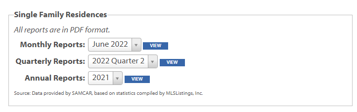
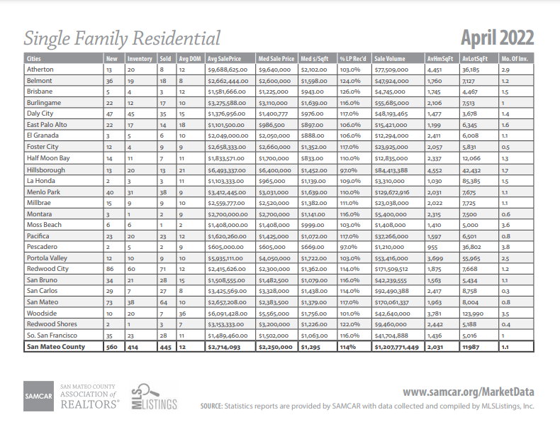
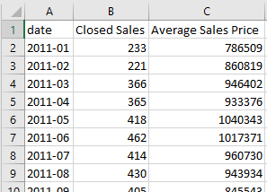

### Summary
- Use a combination of `tabula`'s `read_pdf()` function  and `pandas`' various data manipulation functions in Python to accurately scrape .pdf files  

### Prerequisites/Assumptions
- Windows 10 with administrator privileges (for setting environmental variables)
- Java SE Development Kit installed on your machine ([download](https://www.oracle.com/java/technologies/downloads/))
  - set Java's `PATH` environmental variable to point to the Java directory (see more [here](https://tabula-py.readthedocs.io/en/latest/getting_started.html#installation) under "Get tabula-py working (Windows 10)")  
- Python version ~3.8 ish (I'm using `Python 3.9.12` in Anaconda)
  - Anaconda included packages - Pandas and NumPy
  - Libraries maybe not included in Anaconda: [requests](https://requests.readthedocs.io/en/latest/), [tabula-py](https://github.com/chezou/tabula-py)

### Problem Narrative
I'm interested in conducting a data analysis that involves the market value of single family homes in San Mateo County, California. This data can be hard to come by, but I've found a good county level resource -- The San Mateo Association of Realtors' ["Market Data" page](https://www.samcar.org/member-resources/market-data/).  
|| 
|:--:| 
| *Fig 1: San Mateo Realtors Data Download Page* |  

However, to my dismay, I find that when I download one of these reports, I only get a .pdf containing a single table. It seems to be some sort of export of an Excel table, but the Association of Realtors has not made the actual spreadsheet available. Here is an example of one of their .pdf reports -- in this case for April 2022:

|| 
|:--:| 
| *Fig 2: Example PDF report :(* |  

This is the exact data I want, but there are a few key issues:
- The data are in .pdf files
- You can only download monthly data files one at a time
### Solution
I'll solve this issue by writing a script to do the following:
- Iterate through the urls of each of the monthly reports going back to 2011. For each report:
  - download its .pdf
  - parse and save the data from its .pdf

Start with loading in the necessary libraries:
```python
import pandas as pd
import numpy as np
import requests
from tabula import read_pdf
```
Get right into the script, which implements the pseudo-code I outlined above:
```python
agent = ['Mozilla/5.0 (Windows NT 10.0; Win64; x64)',
         'AppleWebKit/537.36 (KHTML, like Gecko)',
         'Chrome/91.0.4472.114 Safari/537.36']
rows = []
headers = {'user-agent': " ".join(agent)}
for year in range(2011, 2021):
    for month in range(1, 12):
        base = "https://www.samcar.org/userfiles/file/salesstats/"
        url = base + f"SF_{year}{str(month).zfill(2) }.pdf"
        print(url)
        r = requests.get(url,
                         stream=True,
                         headers=headers)
        open('holder.pdf', 'wb').write(r.content)
        df = read_pdf("holder.pdf", pages="all")
        table = df[0].iloc[-1, :]
        table["date"] = f"{year}-{str(month).zfill(2)}"
        rows.append(table)
```
Note: I'm defining `agent` in order to preempt being blocked by the site ([read more](https://developer.mozilla.org/en-US/docs/Glossary/User_agent)).  
What's remarkable about `tabula.read_pdf()` is that *it just works*. I didn't have to really do any tinkering or iterating to get it going. Once it had access to the downloaded .pdf files, it easily and quickly parsed them.  
Now I run into something unique to this data -- some of the .pdf tables had slightly different column names over the years. I implement a fix for that with the following code:
```python
cleaned_rows = []
for row in rows:
    try:
        new = row.rename(
            {"Sales": "Closed Sales",
             "Sold": "Closed Sales",
             "Avg Sales Price": "Average Sales Price",
             "Avg SalePrice": "Average Sales Price",
             "Unnamed: 3": "Closed Sales",
             "Unnamed: 5": "Average Sales Price"})[["date",
                                                    "Closed Sales",
                                                    "Average Sales Price"]]
        cleaned_rows.append(new.to_frame())
    except KeyError:
        print("******error")
```
With the data retrieved and parsed, I perform some final cleaning and arrangement steps before exporting to a .csv
```python
all_years = pd.concat(cleaned_rows, axis=1)
# Transpose the data and set `date` as the index
final_df = all_years.T.set_index("date")
# Get the dollar signs and commas out. E.g. $1,658,900 -> 1658900
final_df["Average Sales Price"] = (final_df["Average Sales Price"]
                                   .str.replace("[\$,]",
                                                "",
                                                regex=True)
                                   .astype(int))
# Closed Sales is discrete count data, so we convert to `int`
final_df["Closed Sales"] = final_df["Closed Sales"].astype(int)
final_df.to_csv("realtors_data_san_mateo.csv")
```
The final product is a satisfying time series data set of the number of closed single family home sales and the average price of those sales over time.
|| 
|:--:| 
| *Fig 3: Final .csv open in Excel* |  

That's surprisingly it.

### Conclusion
Tabula-py is a very convenient and powerful .pdf parser (ported from [Java](https://tabula.technology/)) and easily handled basically all of the .pdfs I put through it.  
  
