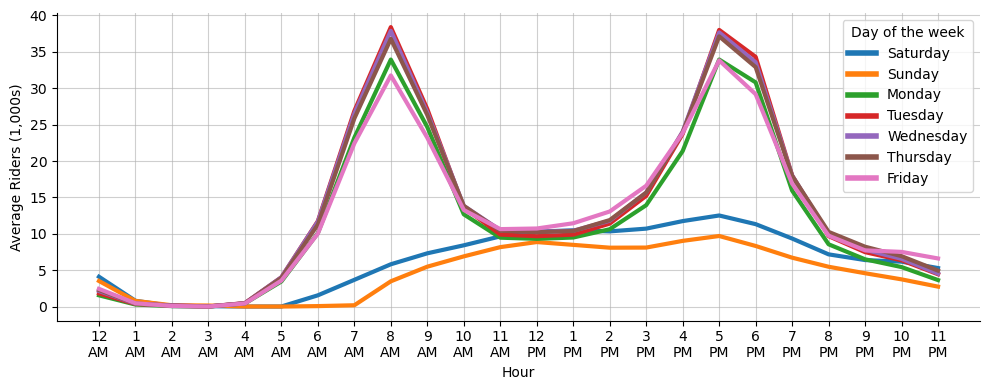
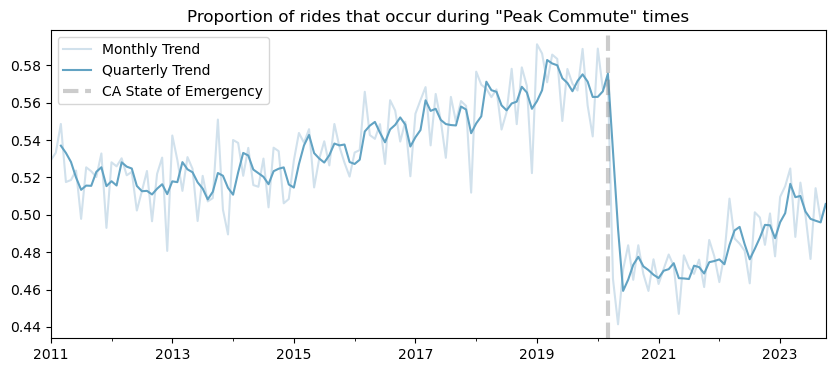

<script src="https://cdnjs.cloudflare.com/ajax/libs/require.js/2.3.6/require.min.js" integrity="sha512-c3Nl8+7g4LMSTdrm621y7kf9v3SDPnhxLNhcjFJbKECVnmZHTdo+IRO05sNLTH/D3vA6u1X32ehoLC7WFVdheg==" crossorigin="anonymous"></script>
<script src="https://cdnjs.cloudflare.com/ajax/libs/jquery/3.5.1/jquery.min.js" integrity="sha512-bLT0Qm9VnAYZDflyKcBaQ2gg0hSYNQrJ8RilYldYQ1FxQYoCLtUjuuRuZo+fjqhx/qtq/1itJ0C2ejDxltZVFg==" crossorigin="anonymous"></script>
<script type="application/javascript">define('jquery', [],function() {return window.jQuery;})</script>


``` python
import pandas as pd
import numpy as np
import dask.dataframe as dd

# Timers
from dask.diagnostics import ProgressBar
from tqdm import tqdm

# Data Visualization
import seaborn as sns
import matplotlib.pyplot as plt

# I/O Utilities
import requests
from bs4 import BeautifulSoup
import os
import sys
from IPython.display import display, HTML
```

``` python
# URL of the webpage to scrape
url = 'http://64.111.127.166/origin-destination/'

# Send an HTTP GET request to the webpage
response = requests.get(url)

# Check if the request was successful
if response.status_code == 200:
    # Parse the content of the webpage with Beautiful Soup
    soup = BeautifulSoup(response.text, 'html.parser')
else:
    print("Failed to retrieve the webpage")
```

I can take a quick look at this webpage by rendering it directly into the jupyter notebook via `display(HTML(_))` from `IPython.display`. Note that I'm rendering the full page here because I know it's very small. If this were a larger, more complex webpage, then I would only render some piece of interest (e.g. a table) in a notebook.

``` python
display(HTML(str(soup)))
```

<!DOCTYPE HTML PUBLIC "-//W3C//DTD HTML 3.2 Final//EN">

<html>
<head>
<title>Index of /origin-destination</title>
</head>
<body>
<h1>Index of /origin-destination</h1>
<pre>      <a href="?C=N;O=D">Name</a>                    <a href="?C=M;O=A">Last modified</a>      <a href="?C=S;O=A">Size</a>  <a href="?C=D;O=A">Description</a><hr/>      <a href="/">Parent Directory</a>                             -   
      <a href="READ%20ME.txt">READ ME.txt</a>             2016-04-19 12:41  482   
      <a href="date-hour-soo-dest-2011.csv.gz">date-hour-soo-dest-2..&gt;</a> 2019-11-15 08:24   34M  
      <a href="date-hour-soo-dest-2012.csv.gz">date-hour-soo-dest-2..&gt;</a> 2019-11-15 08:25   35M  
      <a href="date-hour-soo-dest-2013.csv.gz">date-hour-soo-dest-2..&gt;</a> 2019-11-15 08:25   35M  
      <a href="date-hour-soo-dest-2014.csv.gz">date-hour-soo-dest-2..&gt;</a> 2019-11-15 08:25   36M  
      <a href="date-hour-soo-dest-2015.csv.gz">date-hour-soo-dest-2..&gt;</a> 2019-11-15 08:25   36M  
      <a href="date-hour-soo-dest-2016.csv.gz">date-hour-soo-dest-2..&gt;</a> 2019-11-15 08:25   36M  
      <a href="date-hour-soo-dest-2017.csv.gz">date-hour-soo-dest-2..&gt;</a> 2019-11-15 08:25   36M  
      <a href="date-hour-soo-dest-2018.csv.gz">date-hour-soo-dest-2..&gt;</a> 2019-11-15 08:25   37M  
      <a href="date-hour-soo-dest-2019.csv.gz">date-hour-soo-dest-2..&gt;</a> 2020-01-03 05:39   36M  
      <a href="date-hour-soo-dest-2020.csv.gz">date-hour-soo-dest-2..&gt;</a> 2021-01-03 05:37   20M  
      <a href="date-hour-soo-dest-2021.csv.gz">date-hour-soo-dest-2..&gt;</a> 2022-01-03 05:37   23M  
      <a href="date-hour-soo-dest-2022.csv.gz">date-hour-soo-dest-2..&gt;</a> 2023-01-03 05:37   29M  
      <a href="date-hour-soo-dest-2023.csv.gz">date-hour-soo-dest-2..&gt;</a> 2023-11-03 05:38   26M  
<hr/></pre>
</body></html>

My target here is the set of .csv.gz (compressed .csv files) that contain hourly ridership totals. These are all links, thus are in `<a> </a>` tags, and have an `href` that ends in `.csv.gz`. The following captures links to that specification:

``` python
links = soup.find_all(
    # final all <a></a> content
    'a',
    # filter to only those links with href ending in .csv.gz
    href=lambda x: x and x.endswith(".csv.gz")
    )
```

I can capture the `href` for each of these pieces of html and see that I've captured what I'm looking for.

``` python
files = [l.get('href') for l in links]
files
```

    ['date-hour-soo-dest-2011.csv.gz',
     'date-hour-soo-dest-2012.csv.gz',
     'date-hour-soo-dest-2013.csv.gz',
     'date-hour-soo-dest-2014.csv.gz',
     'date-hour-soo-dest-2015.csv.gz',
     'date-hour-soo-dest-2016.csv.gz',
     'date-hour-soo-dest-2017.csv.gz',
     'date-hour-soo-dest-2018.csv.gz',
     'date-hour-soo-dest-2019.csv.gz',
     'date-hour-soo-dest-2020.csv.gz',
     'date-hour-soo-dest-2021.csv.gz',
     'date-hour-soo-dest-2022.csv.gz',
     'date-hour-soo-dest-2023.csv.gz']

``` python
file_urls = [url + f for f in files]
file_urls
```

    ['http://64.111.127.166/origin-destination/date-hour-soo-dest-2011.csv.gz',
     'http://64.111.127.166/origin-destination/date-hour-soo-dest-2012.csv.gz',
     'http://64.111.127.166/origin-destination/date-hour-soo-dest-2013.csv.gz',
     'http://64.111.127.166/origin-destination/date-hour-soo-dest-2014.csv.gz',
     'http://64.111.127.166/origin-destination/date-hour-soo-dest-2015.csv.gz',
     'http://64.111.127.166/origin-destination/date-hour-soo-dest-2016.csv.gz',
     'http://64.111.127.166/origin-destination/date-hour-soo-dest-2017.csv.gz',
     'http://64.111.127.166/origin-destination/date-hour-soo-dest-2018.csv.gz',
     'http://64.111.127.166/origin-destination/date-hour-soo-dest-2019.csv.gz',
     'http://64.111.127.166/origin-destination/date-hour-soo-dest-2020.csv.gz',
     'http://64.111.127.166/origin-destination/date-hour-soo-dest-2021.csv.gz',
     'http://64.111.127.166/origin-destination/date-hour-soo-dest-2022.csv.gz',
     'http://64.111.127.166/origin-destination/date-hour-soo-dest-2023.csv.gz']

``` python
counter = 1
total = 0
for f in file_urls:
    response = requests.head(f)
    # Retrieve the file size for each file
    file_size = int(response.headers.get('Content-Length', 0))
    # Keep track of the total file size
    total += file_size
    print(f"File {counter} size: {file_size} bytes ({round(file_size*10e-7, 2)} mega-bytes)")
    counter += 1
```

    File 1 size: 35763624 bytes (35.76 mega-bytes)
    File 2 size: 37086081 bytes (37.09 mega-bytes)
    File 3 size: 36504603 bytes (36.5 mega-bytes)
    File 4 size: 37607682 bytes (37.61 mega-bytes)
    File 5 size: 38263683 bytes (38.26 mega-bytes)
    File 6 size: 37896643 bytes (37.9 mega-bytes)
    File 7 size: 37830997 bytes (37.83 mega-bytes)
    File 8 size: 38627139 bytes (38.63 mega-bytes)
    File 9 size: 38177159 bytes (38.18 mega-bytes)
    File 10 size: 21415653 bytes (21.42 mega-bytes)
    File 11 size: 24350926 bytes (24.35 mega-bytes)
    File 12 size: 30546036 bytes (30.55 mega-bytes)
    File 13 size: 27103436 bytes (27.1 mega-bytes)

``` python
print(f"Total size of data: {total*10e-7} mega-bytes")
```

    Total size of data: 441.173662 mega-bytes

``` python
# Create the "data" folder if it doesn't exist
if not os.path.exists('data'):
    os.makedirs('data')
```

``` python
# Download and save the files
for url in tqdm(file_urls):
    filename = os.path.join('data', os.path.basename(url))
    if os.path.exists(filename):
        print(f"File already exists: {filename}")
    else:
        response = requests.get(url)
        if response.status_code == 200:
            with open(filename, 'wb') as file:
                file.write(response.content)
        else:
            print(f"Failed to download: {url}")
```

    100%|██████████| 13/13 [00:00<00:00, 2964.33it/s]

    File already exists: data\date-hour-soo-dest-2011.csv.gz
    File already exists: data\date-hour-soo-dest-2012.csv.gz
    File already exists: data\date-hour-soo-dest-2013.csv.gz
    File already exists: data\date-hour-soo-dest-2014.csv.gz
    File already exists: data\date-hour-soo-dest-2015.csv.gz
    File already exists: data\date-hour-soo-dest-2016.csv.gz
    File already exists: data\date-hour-soo-dest-2017.csv.gz
    File already exists: data\date-hour-soo-dest-2018.csv.gz
    File already exists: data\date-hour-soo-dest-2019.csv.gz
    File already exists: data\date-hour-soo-dest-2020.csv.gz
    File already exists: data\date-hour-soo-dest-2021.csv.gz
    File already exists: data\date-hour-soo-dest-2022.csv.gz
    File already exists: data\date-hour-soo-dest-2023.csv.gz

``` python
# Create a .gitignore file
gitignore_content = "data/\n"  # Content to exclude the "data" folder

with open('.gitignore', 'w') as gitignore_file:
    gitignore_file.write(gitignore_content)
```

``` python
data_paths = ["data/" + f for f in files]
data_paths
```

    ['data/date-hour-soo-dest-2011.csv.gz',
     'data/date-hour-soo-dest-2012.csv.gz',
     'data/date-hour-soo-dest-2013.csv.gz',
     'data/date-hour-soo-dest-2014.csv.gz',
     'data/date-hour-soo-dest-2015.csv.gz',
     'data/date-hour-soo-dest-2016.csv.gz',
     'data/date-hour-soo-dest-2017.csv.gz',
     'data/date-hour-soo-dest-2018.csv.gz',
     'data/date-hour-soo-dest-2019.csv.gz',
     'data/date-hour-soo-dest-2020.csv.gz',
     'data/date-hour-soo-dest-2021.csv.gz',
     'data/date-hour-soo-dest-2022.csv.gz',
     'data/date-hour-soo-dest-2023.csv.gz']

``` python
df = dd.read_csv(data_paths, blocksize=None)
```

``` python
sys.getsizeof(df)*10e-7
```

    4.8e-05

``` python
df.columns = ['Date', 'Hour', 'Start', 'End', 'Riders']
```

``` python
df
```

<div><strong>Dask DataFrame Structure:</strong></div>
<div>
<style scoped>
    .dataframe tbody tr th:only-of-type {
        vertical-align: middle;
    }

    .dataframe tbody tr th {
        vertical-align: top;
    }

    .dataframe thead th {
        text-align: right;
    }
</style>
<table border="1" class="dataframe">
  <thead>
    <tr style="text-align: right;">
      <th></th>
      <th>Date</th>
      <th>Hour</th>
      <th>Start</th>
      <th>End</th>
      <th>Riders</th>
    </tr>
    <tr>
      <th>npartitions=13</th>
      <th></th>
      <th></th>
      <th></th>
      <th></th>
      <th></th>
    </tr>
  </thead>
  <tbody>
    <tr>
      <th></th>
      <td>object</td>
      <td>int64</td>
      <td>object</td>
      <td>object</td>
      <td>int64</td>
    </tr>
    <tr>
      <th></th>
      <td>...</td>
      <td>...</td>
      <td>...</td>
      <td>...</td>
      <td>...</td>
    </tr>
    <tr>
      <th>...</th>
      <td>...</td>
      <td>...</td>
      <td>...</td>
      <td>...</td>
      <td>...</td>
    </tr>
    <tr>
      <th></th>
      <td>...</td>
      <td>...</td>
      <td>...</td>
      <td>...</td>
      <td>...</td>
    </tr>
    <tr>
      <th></th>
      <td>...</td>
      <td>...</td>
      <td>...</td>
      <td>...</td>
      <td>...</td>
    </tr>
  </tbody>
</table>
</div>
<div>Dask Name: rename, 26 tasks</div>

``` python
ProgressBar().register()
```

``` python
df.shape[0].compute()
```

    [                                        ] | 0% Completed |  0.2s

    [########################################] | 100% Completed |  1min 35.6s

    117029110

``` python
df.head()
```

    [                                        ] | 0% Completed |  0.0s

    [########################################] | 100% Completed |  5.5s

<div>
<style scoped>
    .dataframe tbody tr th:only-of-type {
        vertical-align: middle;
    }

    .dataframe tbody tr th {
        vertical-align: top;
    }

    .dataframe thead th {
        text-align: right;
    }
</style>
<table border="1" class="dataframe">
  <thead>
    <tr style="text-align: right;">
      <th></th>
      <th>Date</th>
      <th>Hour</th>
      <th>Start</th>
      <th>End</th>
      <th>Riders</th>
    </tr>
  </thead>
  <tbody>
    <tr>
      <th>0</th>
      <td>2011-01-01</td>
      <td>0</td>
      <td>12TH</td>
      <td>16TH</td>
      <td>1</td>
    </tr>
    <tr>
      <th>1</th>
      <td>2011-01-01</td>
      <td>0</td>
      <td>12TH</td>
      <td>24TH</td>
      <td>3</td>
    </tr>
    <tr>
      <th>2</th>
      <td>2011-01-01</td>
      <td>0</td>
      <td>12TH</td>
      <td>ASHB</td>
      <td>2</td>
    </tr>
    <tr>
      <th>3</th>
      <td>2011-01-01</td>
      <td>0</td>
      <td>12TH</td>
      <td>BAYF</td>
      <td>5</td>
    </tr>
    <tr>
      <th>4</th>
      <td>2011-01-01</td>
      <td>0</td>
      <td>12TH</td>
      <td>CIVC</td>
      <td>3</td>
    </tr>
  </tbody>
</table>
</div>

### Subsets for In-Memory Analysis

``` python
df_stations = df.groupby(['Date', 'Start', 'End'])['Riders'].sum().compute()
```

    [########################################] | 100% Completed |  2min 22.8s

``` python
sys.getsizeof(df_stations)*10e-7
```

    118.923323

Condensing via grouping

``` python
df_rph = df.groupby(['Date', 'Hour'])['Riders'].sum().compute()
```

    [########################################] | 100% Completed |  1min 12.9s

``` python
sys.getsizeof(df_rph)*10e-7
```

    1.600422

``` python
df_rph = df_rph.reset_index()
df_rph.head()
```

<div>
<style scoped>
    .dataframe tbody tr th:only-of-type {
        vertical-align: middle;
    }

    .dataframe tbody tr th {
        vertical-align: top;
    }

    .dataframe thead th {
        text-align: right;
    }
</style>
<table border="1" class="dataframe">
  <thead>
    <tr style="text-align: right;">
      <th></th>
      <th>Date</th>
      <th>Hour</th>
      <th>Riders</th>
    </tr>
  </thead>
  <tbody>
    <tr>
      <th>0</th>
      <td>2011-01-01</td>
      <td>0</td>
      <td>5174</td>
    </tr>
    <tr>
      <th>1</th>
      <td>2011-01-01</td>
      <td>1</td>
      <td>15479</td>
    </tr>
    <tr>
      <th>2</th>
      <td>2011-01-01</td>
      <td>2</td>
      <td>11055</td>
    </tr>
    <tr>
      <th>3</th>
      <td>2011-01-01</td>
      <td>3</td>
      <td>5592</td>
    </tr>
    <tr>
      <th>4</th>
      <td>2011-01-01</td>
      <td>4</td>
      <td>795</td>
    </tr>
  </tbody>
</table>
</div>

``` python
df_rph.shape
```

    (104896, 3)

``` python
df_rph['Date'] = pd.to_datetime(df_rph['Date'], format="%Y-%m-%d")
df_rph['Hour_12'] = pd.to_datetime(df_rph['Hour'], format='%H').dt.strftime('%I:%M %p')
df_rph['Hour_12'] = df_rph['Hour_12'].str.replace(":00 ", "\n").str.strip("0")
df_rph['day_of_week'] = df_rph['Date'].dt.day_name()
df_rph['Weekend'] = df_rph['day_of_week'].isin(['Saturday', 'Sunday'])
```

``` python
df_rph.head()
```

<div>
<style scoped>
    .dataframe tbody tr th:only-of-type {
        vertical-align: middle;
    }

    .dataframe tbody tr th {
        vertical-align: top;
    }

    .dataframe thead th {
        text-align: right;
    }
</style>
<table border="1" class="dataframe">
  <thead>
    <tr style="text-align: right;">
      <th></th>
      <th>Date</th>
      <th>Hour</th>
      <th>Riders</th>
      <th>Hour_12</th>
      <th>day_of_week</th>
      <th>Weekend</th>
    </tr>
  </thead>
  <tbody>
    <tr>
      <th>0</th>
      <td>2011-01-01</td>
      <td>0</td>
      <td>5174</td>
      <td>12\nAM</td>
      <td>Saturday</td>
      <td>True</td>
    </tr>
    <tr>
      <th>1</th>
      <td>2011-01-01</td>
      <td>1</td>
      <td>15479</td>
      <td>1\nAM</td>
      <td>Saturday</td>
      <td>True</td>
    </tr>
    <tr>
      <th>2</th>
      <td>2011-01-01</td>
      <td>2</td>
      <td>11055</td>
      <td>2\nAM</td>
      <td>Saturday</td>
      <td>True</td>
    </tr>
    <tr>
      <th>3</th>
      <td>2011-01-01</td>
      <td>3</td>
      <td>5592</td>
      <td>3\nAM</td>
      <td>Saturday</td>
      <td>True</td>
    </tr>
    <tr>
      <th>4</th>
      <td>2011-01-01</td>
      <td>4</td>
      <td>795</td>
      <td>4\nAM</td>
      <td>Saturday</td>
      <td>True</td>
    </tr>
  </tbody>
</table>
</div>

``` python
df_rph_d = df_rph.set_index("Date")

fig, ax = plt.subplots(figsize=(10, 4))
every_two = df_rph_d.index.year.unique()[::2][:-1]
labs = (
    df_rph_d.loc[str(every_two[-2]):str(every_two[-1])].resample("M")['Riders'].sum().index.month_name().str[:3] +
    df_rph_d.loc[str(every_two[-2]):str(every_two[-1])].resample("M")['Riders'].sum().index.year.astype(str).str[-2:]
    )

for i in range(len(every_two)-1):
    a = 1 if (every_two[i+1] == every_two[-1]) else .5
    subset = df_rph_d.loc[str(every_two[i]):str(every_two[i+1])]
    subset_time_series = subset.resample("M")['Riders'].sum().reset_index().set_index(labs)['Riders']
    subset_time_series.plot(linewidth=3,
                                                                                      ax=ax,
                                                                                      alpha=a,
                                                                                      label=fr"${every_two[i]} \rightarrow {every_two[i+1]}$")
ax.set_ylim(0)
ax.axvline(np.where(subset_time_series.index == 'Jan20'),
           linestyle=":",
           label="First Covid Case in CA",
           color="black",
           linewidth=3,
           alpha=.4)
ax.legend();
```


``` python
days = df_rph['day_of_week'].unique()
colors = sns.color_palette("tab10")
colormap = {}
for d, c in zip(days, colors[:len(days)]):
    colormap[d] = c
```

``` python
colormap
```

    {'Saturday': (0.12156862745098039, 0.4666666666666667, 0.7058823529411765),
     'Sunday': (1.0, 0.4980392156862745, 0.054901960784313725),
     'Monday': (0.17254901960784313, 0.6274509803921569, 0.17254901960784313),
     'Tuesday': (0.8392156862745098, 0.15294117647058825, 0.1568627450980392),
     'Wednesday': (0.5803921568627451, 0.403921568627451, 0.7411764705882353),
     'Thursday': (0.5490196078431373, 0.33725490196078434, 0.29411764705882354),
     'Friday': (0.8901960784313725, 0.4666666666666667, 0.7607843137254902)}

``` python
fig, ax = plt.subplots(figsize=(10, 4))
sns.despine(top=True, ax=ax)
sns.set_palette("PuBuGn_d")
g = sns.lineplot(
    data=df_rph.assign(riders_k = lambda x: x['Riders']/1000),
    x='Hour_12',
    y='riders_k',
    hue='day_of_week',
    palette=colormap,
    linewidth=3,
    estimator='mean',
    errorbar=None,
    ax=ax)
ax.set(
    ylabel="Average Riders (1,000s)",
    xlabel="Hour")
legend = ax.get_legend()
legend.set_title("Day of the week")
for line in legend.get_lines():
    line.set_linewidth(4.0)

ax.grid(alpha=.6)
fig.tight_layout()
```



``` python
years = df_rph['Date'].dt.year.unique()[1:]
years = years.reshape(4, 3)
fig, axes = plt.subplots(4, 3, sharex=True, sharey=True, figsize=(7, 7))

for m in range(years.shape[0]):
    for n in range(years.shape[1]):
        year = years[m, n]
        subset = df_rph[df_rph['Date'].dt.year == year]
        sns.lineplot(
            data=subset.assign(riders_k = lambda x: x['Riders']/1000),
            x='Hour',
            y='riders_k',
            hue='day_of_week',
            palette=colormap,
            linewidth=1,
            legend=False,
            estimator='mean',
            errorbar=None,
            ax=axes[m, n])
        axes[m, n].set(ylabel=None, xlabel=None, title=year) 
        
fig.supxlabel("Hour")
fig.supylabel("Average Riders (1,000s)")      
fig.tight_layout()
```


``` python
weekday_load = (df_rph
                .groupby([
                    df_rph['Date'].dt.year,
                    df_rph['Date'].dt.month,
                    (df_rph['Hour'].isin([7, 8, 9, 16, 17, 18, 19])) &
                    ~df_rph['Weekend']]
                    )
                ['Riders']
                .sum()
                .unstack()
                .dropna(axis=0)
                .apply(lambda x: x[True]/(x[True]+x[False]), axis=1)
                .rename_axis(index=['Year', 'Month']))
```

``` python
weekday_load_vec = (
    weekday_load
    .reset_index()
    .set_index(
        pd.to_datetime(weekday_load.reset_index()['Year'].astype(str) +
                       "-" +
                       weekday_load.reset_index()['Month'].astype(str)
                       )) # Build a new Year-Month index
    [0].rename("Percent") # The series was, by default, named `0`. Here we rename to Percent
    .iloc[:-1] # Remove the most recent month, as it is typically unfinished
    )
```

``` python
fig, ax = plt.subplots(figsize=(10, 4))
weekday_load_vec.plot(alpha=.4, ax=ax, label="Monthly Trend")
weekday_load_vec.rolling(3).mean().plot(ax=ax, label="Quarterly Trend")
ax.axvline("2020-03-04", linestyle="--", label="CA State of Emergency",  color="grey", linewidth=3, alpha=.4)
ax.set_title("Proportion of rides that occur during \"Peak Commute\" times")
ax.legend();
```


