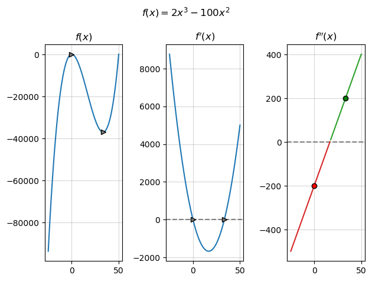

<script src="https://cdnjs.cloudflare.com/ajax/libs/require.js/2.3.6/require.min.js" integrity="sha512-c3Nl8+7g4LMSTdrm621y7kf9v3SDPnhxLNhcjFJbKECVnmZHTdo+IRO05sNLTH/D3vA6u1X32ehoLC7WFVdheg==" crossorigin="anonymous"></script>
<script src="https://cdnjs.cloudflare.com/ajax/libs/jquery/3.5.1/jquery.min.js" integrity="sha512-bLT0Qm9VnAYZDflyKcBaQ2gg0hSYNQrJ8RilYldYQ1FxQYoCLtUjuuRuZo+fjqhx/qtq/1itJ0C2ejDxltZVFg==" crossorigin="anonymous"></script>
<script type="application/javascript">define('jquery', [],function() {return window.jQuery;})</script>


``` python

import pandas as pd
import re

with open("index.md", "r") as f:
    markdown = f.readlines()
```

``` python

markdown = pd.DataFrame(markdown)
markdown.columns = ['text']
```

``` python
markdown['content'] = ~markdown['text'].str.contains(r'^\s*$', regex=True)
```

``` python
markdown
```

<div>
<style scoped>
    .dataframe tbody tr th:only-of-type {
        vertical-align: middle;
    }

    .dataframe tbody tr th {
        vertical-align: top;
    }

    .dataframe thead th {
        text-align: right;
    }
</style>
<table border="1" class="dataframe">
  <thead>
    <tr style="text-align: right;">
      <th></th>
      <th>text</th>
      <th>content</th>
    </tr>
  </thead>
  <tbody>
    <tr>
      <th>0</th>
      <td>---\n</td>
      <td>True</td>
    </tr>
    <tr>
      <th>1</th>
      <td>title: "Calc 1: Simple Constrained Optimizatio...</td>
      <td>True</td>
    </tr>
    <tr>
      <th>2</th>
      <td>date: 2023-07-04\n</td>
      <td>True</td>
    </tr>
    <tr>
      <th>3</th>
      <td>draft: false\n</td>
      <td>True</td>
    </tr>
    <tr>
      <th>4</th>
      <td>draft: false\n</td>
      <td>True</td>
    </tr>
    <tr>
      <th>...</th>
      <td>...</td>
      <td>...</td>
    </tr>
    <tr>
      <th>346</th>
      <td>\n</td>
      <td>False</td>
    </tr>
    <tr>
      <th>347</th>
      <td>\n</td>
      <td>False</td>
    </tr>
    <tr>
      <th>348</th>
      <td>{{&lt; /details &gt;}}\n</td>
      <td>True</td>
    </tr>
    <tr>
      <th>349</th>
      <td>\n</td>
      <td>False</td>
    </tr>
    <tr>
      <th>350</th>
      <td>If we were to want to maximize this function b...</td>
      <td>True</td>
    </tr>
  </tbody>
</table>
<p>351 rows × 2 columns</p>
</div>

``` python
markdown = markdown.reset_index()
```

``` python
content_df = markdown[markdown['content']].reset_index(drop=True)
```

``` python
content_df
```

<div>
<style scoped>
    .dataframe tbody tr th:only-of-type {
        vertical-align: middle;
    }

    .dataframe tbody tr th {
        vertical-align: top;
    }

    .dataframe thead th {
        text-align: right;
    }
</style>
<table border="1" class="dataframe">
  <thead>
    <tr style="text-align: right;">
      <th></th>
      <th>index</th>
      <th>text</th>
      <th>content</th>
    </tr>
  </thead>
  <tbody>
    <tr>
      <th>0</th>
      <td>0</td>
      <td>---\n</td>
      <td>True</td>
    </tr>
    <tr>
      <th>1</th>
      <td>1</td>
      <td>title: "Calc 1: Simple Constrained Optimizatio...</td>
      <td>True</td>
    </tr>
    <tr>
      <th>2</th>
      <td>2</td>
      <td>date: 2023-07-04\n</td>
      <td>True</td>
    </tr>
    <tr>
      <th>3</th>
      <td>3</td>
      <td>draft: false\n</td>
      <td>True</td>
    </tr>
    <tr>
      <th>4</th>
      <td>4</td>
      <td>draft: false\n</td>
      <td>True</td>
    </tr>
    <tr>
      <th>...</th>
      <td>...</td>
      <td>...</td>
      <td>...</td>
    </tr>
    <tr>
      <th>217</th>
      <td>339</td>
      <td>fig.tight_layout()\n</td>
      <td>True</td>
    </tr>
    <tr>
      <th>218</th>
      <td>340</td>
      <td>```\n</td>
      <td>True</td>
    </tr>
    <tr>
      <th>219</th>
      <td>344</td>
      <td>\n</td>
      <td>True</td>
    </tr>
    <tr>
      <th>220</th>
      <td>348</td>
      <td>{{&lt; /details &gt;}}\n</td>
      <td>True</td>
    </tr>
    <tr>
      <th>221</th>
      <td>350</td>
      <td>If we were to want to maximize this function b...</td>
      <td>True</td>
    </tr>
  </tbody>
</table>
<p>222 rows × 3 columns</p>
</div>

``` python
content = content_df['text'].values
```

``` python
for i in range(len(content)):
    if "" in content[i] and "![png]" in content[i-1]:
        print(content[i-1], content[i])
        print(content_df['index'][i-1], content_df['index'][i])
        
        markdown['text'][content_df['index'][i-1]] = content[i]
        markdown['text'][content_df['index'][i]] = content[i-1]
```

    
     

    66 70
    
     

    122 126
    
       

    187 191
    
       

    292 296
    
     

    344 348

    C:\Users\peteramerkhanian\AppData\Local\Temp\ipykernel_3908\3599190953.py:6: SettingWithCopyWarning: 
    A value is trying to be set on a copy of a slice from a DataFrame

    See the caveats in the documentation: https://pandas.pydata.org/pandas-docs/stable/user_guide/indexing.html#returning-a-view-versus-a-copy
      markdown['text'][content_df['index'][i-1]] = content[i]
    C:\Users\peteramerkhanian\AppData\Local\Temp\ipykernel_3908\3599190953.py:7: SettingWithCopyWarning: 
    A value is trying to be set on a copy of a slice from a DataFrame

    See the caveats in the documentation: https://pandas.pydata.org/pandas-docs/stable/user_guide/indexing.html#returning-a-view-versus-a-copy
      markdown['text'][content_df['index'][i]] = content[i-1]

``` python
new_text = "".join(markdown['text'])

with open("index.md", "w") as f:
    markdown = f.write(new_text)
```
